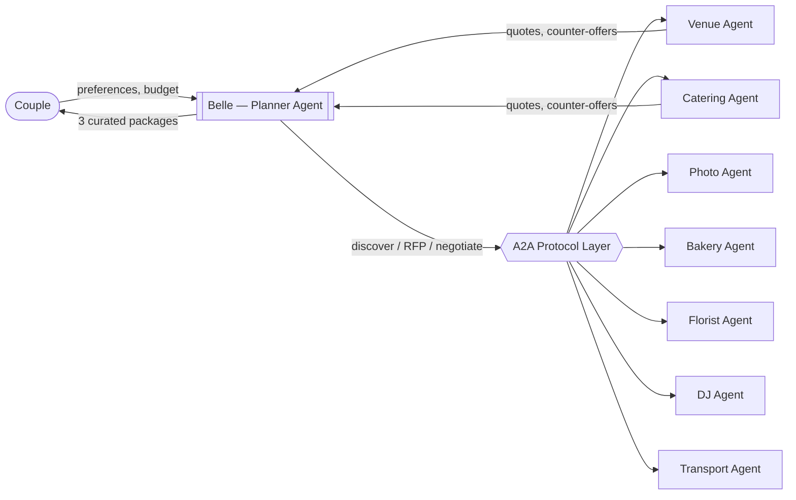

# Altara

**An agent-to-agent (A2A) marketplace for wedding planning.** Belle, an AI wedding planner, negotiates with vendor agents across multiple categories in parallel and returns curated packages to the couple.

> Live demo: [altara-landing.up.railway.app](https://altara-landing.up.railway.app) · Try a negotiation: [altara-landing.up.railway.app/simulate.html](https://altara-landing.up.railway.app/simulate.html)

This repository is the HW9 academic release for **MIT MAS.664 — Agentic AI** (Spring 2026, Prof. Ramesh Raskar). It ships the A2A negotiation engine, a reference vendor agent, the simulation UI, and the experiment harness used in HW7 and HW8.

---

## Why this exists

The U.S. wedding industry is ~$70B and largely unautomated. Couples juggle 10–15 vendors by email and phone; vendors juggle hundreds of couples the same way. Existing marketplaces (The Knot, Zola) are directories — they don't negotiate. Altara is an experiment in whether a planner agent and vendor agents, talking over a shared A2A protocol, can actually coordinate a booking end to end.

---

## Architecture



Plain English:
1. The couple enters preferences (budget, guest count, date, service style, dietary needs).
2. **Belle** — the planner agent — runs a pre-screen and launches parallel A2A negotiations across categories.
3. Each **vendor agent** has private business constraints (price floors, capacity, blackout dates) it will not disclose to Belle. It negotiates on behalf of its vendor.
4. Belle aggregates offers and returns **Budget**, **Recommended**, and **Premium** packages.

Deeper explanation: [docs/ARCHITECTURE.md](docs/ARCHITECTURE.md). Message format: [docs/PROTOCOL.md](docs/PROTOCOL.md).

---

## Quickstart

You'll need:
- Node.js 18+
- An Anthropic API key

```bash
git clone https://github.com/ElleCeeMITAI/altara-landing.git
cd altara-landing
npm install
cp .env.example .env          # then edit .env and paste your key
npm start
```

Open `http://localhost:3000` for the marketplace page, or `http://localhost:3000/simulate` for the live negotiation UI.

---

## Usage

### Run a live multi-category negotiation (in the browser)

1. Visit `http://localhost:3000/simulate` (or [the hosted demo](https://altara-landing.up.railway.app/simulate.html)).
2. Enter budget, guest count, service style, cuisine preference, and dietary needs.
3. Click **Run simulation**. You'll see Belle and each vendor agent exchange messages in real time as the negotiation unfolds.

### Talk to the vendor agent directly over A2A

The reference vendor agent (Grand Meridian Ballroom catering) exposes an A2A-compliant HTTP interface:

```bash
# Discover the agent
curl https://altara-landing.up.railway.app/.well-known/agent.json

# Send a message
curl -X POST https://altara-landing.up.railway.app/api/agent \
  -H "Content-Type: application/json" \
  -d '{"intent": "discover"}'
```

Full intent list, request/response shape, and multi-turn state handling: [docs/PROTOCOL.md](docs/PROTOCOL.md).

### Run the experiment harness

HW7 and HW8 ran three experiments (RFP vs. auction, sequential vs. parallel scaling, failure-recovery). Raw results are in `results/`:

```bash
node run_experiments.js       # reproduces the negotiation experiments
```

Summaries: [docs/EXPERIMENTS.md](docs/EXPERIMENTS.md).

---

## Project layout

```
.
├── server.js                    # Express app, A2A endpoints, SSE streaming
├── agents.js                    # Reference CatererAgent, simulation engine
├── negotiate.js                 # Single-vendor live Claude-powered negotiation
├── negotiate-multi.js           # Multi-category parallel negotiation
├── run_experiments.js           # HW7/HW8 experiment runner
├── prompts/                     # Vendor agent system prompt templates
├── vendors/                     # Synthetic vendor data (7 categories, ~30 vendors)
├── public/                      # Landing page + simulate UI
├── docs/                        # Architecture, protocol, experiments, testing
├── results/                     # HW7/HW8 experiment outputs (CSV + JSON)
└── skills.md                    # A2A skills doc served from /skills.md
```

---

## Limitations

Be warned — this is a student prototype built for a class, not a production system.

- **Simulated vendors only.** The `vendors/` directory contains synthetic vendor data. No real businesses are wired in.
- **No real payments.** Booking confirmation returns a mock confirmation number; no money moves.
- **Single region.** All synthetic vendors are in Greater Boston with a fixed 2027-06-12 event date.
- **Bounded demo ranges.** The hosted simulate page enforces budget $20k–$100k and guest count 20–75 for predictable demos.
- **One real A2A vendor endpoint.** Only Grand Meridian Ballroom catering is exposed at `/api/agent`. Other categories negotiate in-process during the simulation, not over HTTP.
- **Rate-limited demo.** The hosted instance allows 3 simulations per visitor per day.
- **Model:** Demos use Claude Haiku for cost; experiments in `results/` were run on Claude Sonnet.

---

## Roadmap

High-level only:
- Expose all seven categories over HTTP A2A (not just catering).
- Harden the protocol spec with auth, idempotency, and cancellation semantics.
- Real vendor onboarding pilot (Boston).
- Integrate booking confirmations into a persistent calendar + budget view.

Commercial roadmap, pricing, go-to-market, and product detail are intentionally not in this repository.

---

## Peer testing (for classmates)

If you want to try Altara for your HW9 peer test, see [docs/TESTING.md](docs/TESTING.md). The short version: use the hosted simulate page, log what happened, fill in the feedback form. No local setup required unless you want to inspect the code.

---

## License

[PolyForm Noncommercial License 1.0.0](LICENSE). You may read, run, fork, and modify this code for noncommercial research, study, and personal use. Commercial use requires a separate agreement with the copyright holder.

Why this license: Altara is a class project that is also an early-stage commercial effort. This license lets classmates, researchers, and the community learn from the work while protecting the commercial roadmap from being replicated wholesale.

---

## Credits

Built by **Lisa Caruso** for **MIT MAS.664 — Agentic AI**, Spring 2026, Prof. **Ramesh Raskar**.

Architecture and implementation: Lisa Caruso. Iteration and code assistance: Anthropic's Claude via Claude Code.
